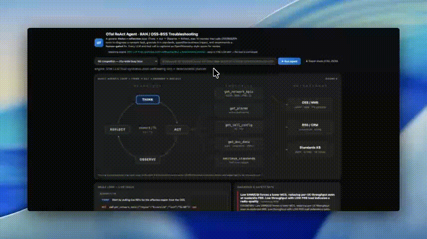

# Open Telco (OTel) on Databricks

```
A chapter-by-chapter, runnable guide to exploring the Open Telco (OTel) telecom-domain
models and building them into a governed, observable "self-healing network" assistant on
Databricks. 
```

> **OTel here means _Open Telco_,** It is a family of telecom-domain
> fine-tuned models (embedding · reranker · LLM · safety) trained on 3GPP, GSMA, and O-RAN
> standards, published on
> [`HuggingFace`](https://huggingface.co/farbodtavakkoli).

## The vision, in one picture

```
   incident  ->  ReAct agent   ->  embed -> vector search -> rerank -> grounded LLM -> safety gate -> recommendation
   (app/app.py)  (Think->Act->        \_______________ Open Telco (OTel) models ______________/        (human-approved)
                  Observe->Reflect)         served + governed + captured on Databricks
```

[`app/app.py`](./app/app.py) is the **north star**: a ReAct + reflection agent that troubleshoots
a RAN/OSS-BSS incident, grounds its diagnosis in telecom standards, and recommends a
human-gated fix — every LLM and tool call captured as OpenTelemetry-style spans. It starts with
two stand-ins (a keyword retriever, a mock brain); the chapters progressively replace them with
the real Open Telco models on Databricks.

## Chapters

Each chapter is a **self-contained notebook** (its narrative is in the notebook itself), and they
all run on Databricks — serverless or a cluster. Work the ladder in order: Chapters 0–2 build the
intuition (load a model, assemble the RAG pipeline, run the agent loop), then Chapters 3–4
**productionize** it.

| # | Chapter (notebook) | What you get |
|---|--------------------|--------------|
| 0 | [Vision + Step 0](./notebooks/00_starter_load_and_inference.ipynb) | Load & inference your first OTel model — "it's real" |
| 1 | [The OTel RAG pipeline](./notebooks/01_otel_rag_pipeline.ipynb) | embed → retrieve → rerank → ground → **abstain**, with production lessons baked in |
| 2 | [The self-healing agent loop](./notebooks/02_self_healing_agent_loop.ipynb) | A ReAct agent grounded in OTel retrieval, ending in a **human-gated** recommendation |
| 3 | [Productionize on Databricks](./notebooks/03_productionize_on_databricks.ipynb) | Log → Unity Catalog → Model Serving → Vector Search |
| 4 | [Govern & capture](./notebooks/04_govern_and_capture.ipynb) | **Inference tables** + monitoring + cost-economics ledger |

## Make it real (end to end)

[`deploy/`](./deploy/) codifies the **entire live stack** — governed Unity Catalog data, a served
OTel embedding model + Vector Search index, a served OTel LLM, inference-table capture, service-
principal grants, and the animated app — reproducible with one command:

```bash
./deploy/deploy.sh <your-databricks-cli-profile>
```

See [`deploy/README.md`](./deploy/README.md) for the details.

## Video Overview



_A short capture of the app: pick a scenario and watch the ReAct loop (Think -> Act -> Observe -> Reflect) call the OTel tools, ground in Vector Search, reason with the served OTel LLM, and end in a human-gated recommendation._

## Installation

Clone this repo into your workspace as a Git folder (Repos), or import the notebooks, and run
them on serverless or a cluster. On serverless / standard clusters run the first `%pip install`
cell in each notebook (it restarts Python); the ML runtime already ships `torch`/`transformers`.
Chapters 0–2 download the OTel model weights (embedding ~335M, reranker ~0.6B) from HuggingFace on
first run and cache them.

Chapters 3–4 additionally need UC write access, a Model Serving entitlement, and a Vector Search
endpoint, and create billable resources — each notebook has a cleanup cell.

**Full live deployment:** `./deploy/deploy.sh <profile>` (see above).

## How to get help

Databricks support doesn't cover this content. For questions or bugs, please open a GitHub
issue and the team will help on a best effort basis.

## License

&copy; 2025 Databricks, Inc. All rights reserved. The source in this notebook is provided
subject to the Databricks License [https://databricks.com/db-license-source]. All included or
referenced third party libraries are subject to the licenses set forth below.

| library | description | license | source |
|---------|-------------|---------|--------|
| sentence-transformers | Sentence & text embeddings | Apache-2.0 | https://github.com/UKPLab/sentence-transformers |
| transformers | Model loading / inference | Apache-2.0 | https://github.com/huggingface/transformers |
| torch | Tensor / DL runtime | BSD-3-Clause | https://github.com/pytorch/pytorch |
| numpy | Numerical arrays | BSD-3-Clause | https://github.com/numpy/numpy |
| mlflow | Model logging & registry | Apache-2.0 | https://github.com/mlflow/mlflow |
| databricks-sdk | Databricks SDK for Python | Apache-2.0 | https://github.com/databricks/databricks-sdk-py |
| databricks-vectorsearch | Vector Search client | Apache-2.0 | https://pypi.org/project/databricks-vectorsearch/ |
| Open Telco (OTel) models | Telecom-domain fine-tunes | inherit base-checkpoint terms (datasets Apache-2.0) | https://huggingface.co/farbodtavakkoli |
